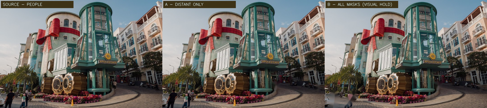

# R19 - Thử tách người khỏi cảnh Apollo (10/10/2026)

**Tình trạng: thử nghiệm ảnh nguồn, CHƯA nâng cấp mô hình Gaussian R17G.**

## Đối chiếu trước / sau

[Ảnh phương án A - chỉ xóa người nhỏ ở xa](R19_CLEAN_SMALL_PERSONS_STAGE_A.jpg)

- Ảnh trái: nguồn Apollo Café hiện đang dùng cho mô hình R17G.
- Ảnh giữa (A): che và phục hồi một số người ở xa bằng OpenCV TELEA; chưa hoàn toàn tự nhiên nhưng ít ảnh hưởng kiến trúc hơn.
- Ảnh phải (B): thử xóa bảy nhóm người, có mảng nhòe thấy rõ ở mặt đường, **VISUAL FAIL / không dùng làm texture R17G**.

Việc inpainting chỉ **dự đoán** mặt đường/cảnh vật bị người che khuất. Không ai có thể khôi phục chi tiết thực mà ảnh nguồn không ghi lại. Cần cảnh quét nhiều góc/vùng không có người để sạch thật.

**Kỹ thuật:** mặt nạ vùng người xác định thủ công từ ảnh gốc 1920×1280, thu nhỏ xử lý 960×640 trên CPU (7 nhóm, 2,54% vùng che cho phương án B). R17G SOG gốc và sản phẩm cũ được giữ nguyên.

**Định hướng:** Tách lớp tĩnh của cảnh và lớp nhân vật động. Sau khi có nguồn hình sạch, tạo Gaussian cho nền, thêm NPC/collision riêng. Kết hợp human-aware 3DGS masking/pruning cho bộ dữ liệu đa góc; không biến người trong ảnh thành nhân vật động chỉ bằng xoay camera.

**Nguồn ảnh:** Vivu Vietnam, [Wikimedia Commons - Apollo Café](https://commons.wikimedia.org/wiki/File:Apollo_Cafe_daytime_street_view_Sunset_Town_Phu_Quoc_Vietnam.jpg), [CC BY-SA 4.0](https://creativecommons.org/licenses/by-sa/4.0/). Chỉnh sửa: tạo mặt nạ, nội suy nội dung dưới vùng che bằng OpenCV, thu nhỏ/chèn chú thích. Tư liệu R&D CC BY-SA 4.0.

**Không triển khai:** Chỉ là branch tài liệu minh chứng công khai. Không deploy, không merge, không Cloudflare, không chỉnh Core V1.2 và không phát sinh AI trả phí.

[Video WebGL 12 giây hiện có (R17G)](LIVINGPQ_APOLLO_R17G_WEBGL_MOTION_12_SECONDS.mp4)
