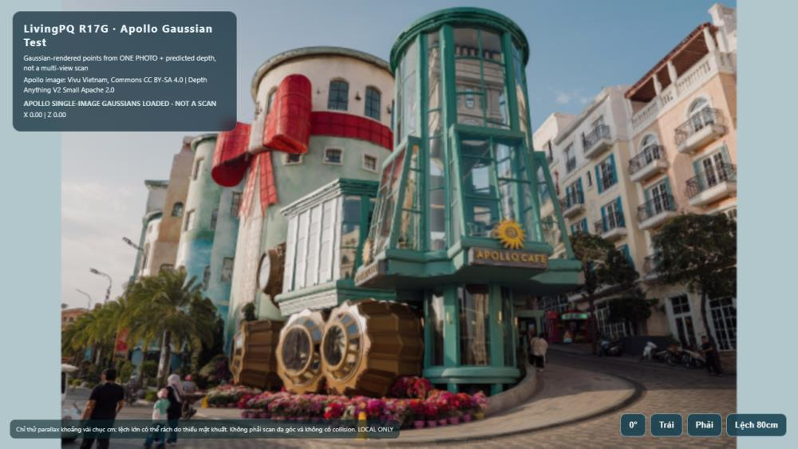
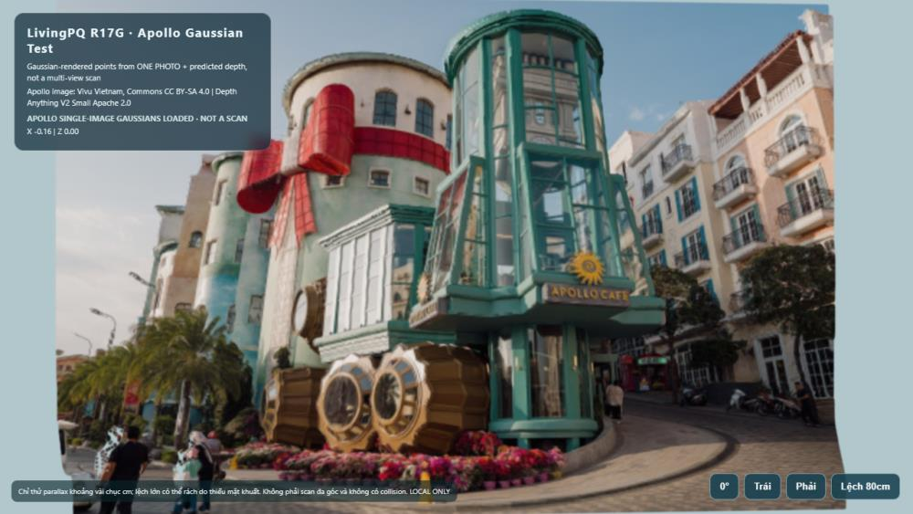
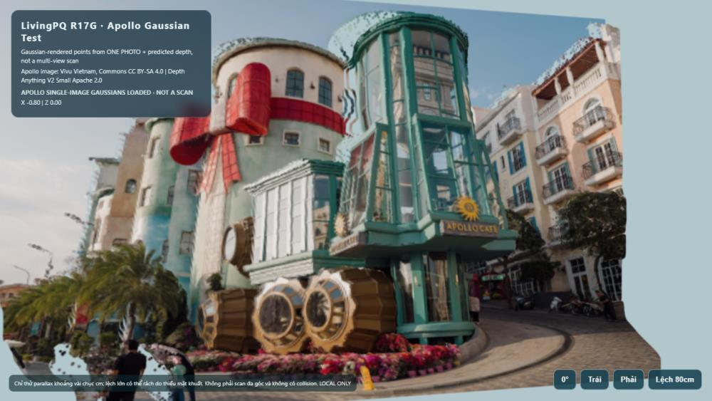

# LivingPQ R17G - Ảnh WebGL Apollo Café (10/10/2026)

**Bộ ảnh bằng chứng nghiên cứu, không phải trang web triển khai.** Đây là các ảnh chụp trực tiếp Microsoft Edge từ PlayCanvas WebGL trên PHUQUOCLUX.

### 1. Góc chính diện

### 2. Dịch camera sang trái

### 3. Lệch camera 80 cm (hiện lỗi)

**Về dữ liệu:** 221.184 Gaussian tạo từ **một ảnh thật** cộng chiều sâu dự đoán bằng Depth Anything V2 Small; nén thành SOG và render bằng PlayCanvas. Đây **không phải** dữ liệu quét đa góc, không phải 100 m² đi lại tự do. Góc lệch 80 cm có lỗi rách/mặt khuất.

**Ảnh gốc / ghi công:** [Vivu Vietnam, Apollo Cafe daytime street view Sunset Town Phu Quoc Vietnam](https://commons.wikimedia.org/wiki/File%3AApollo_Cafe_daytime_street_view_Sunset_Town_Phu_Quoc_Vietnam.jpg), Wikimedia Commons, [CC BY-SA 4.0](https://creativecommons.org/licenses/by-sa/4.0/). **Các thay đổi:** suy luận độ sâu, chuyển điểm ảnh thành Gaussian, nén SOG, render WebGL và thu nhỏ JPEG. Hình phái sinh được chia sẻ theo CC BY-SA 4.0; không xóa ghi công khi tái sử dụng.

**Mô hình / phần mềm:** Depth Anything V2 Small (Apache-2.0), PlayCanvas (MIT), SplatTransform (MIT).

**Bảo vệ hệ thống:** Đây là nhánh ảnh độc lập, không chứa workflows, không có code ứng dụng, không merge vào `main`, không deploy, không động tới OpenPQ Core V1.2 hay production.

**Trạng thái visual:** mới đủ làm preview near-original-camera. Chưa đạt bài kiểm tra di chuyển 1-2 m trong không gian 3D.
